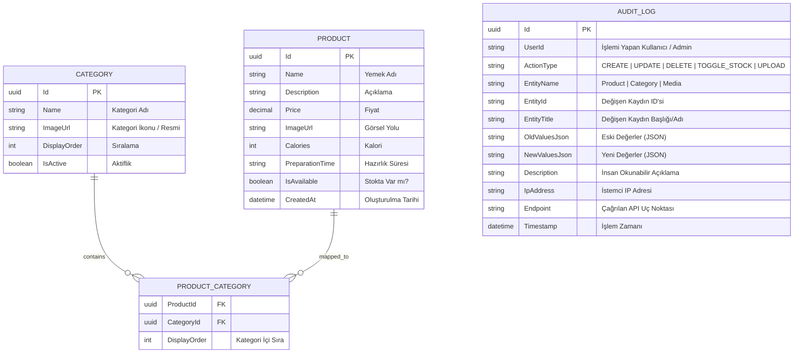

# 🍽️ QR Menü Sistemi: Kapsamlı Mimari, Sadeleştirme ve Geliştirme Rehberi

Bu döküman; **Angular (Frontend)** ve **.NET (Backend)** teknolojileriyle geliştirilecek modern, hızlı, dinamik, yönetilebilir ve **tüm hareketlerin veritabanında denetlendiği (Audit / Activity Logging)** bir restoran **QR Menü** uygulamasının baştan sona tüm mimari, veritabanı, tasarım ve kodlama standartlarını detaylandırmak üzere hazırlanmıştır.

---

# BÖLÜM 1: Mevcut Projelerin Analizi ve Törpüleme (Eliminasyon) Raporu

Elinizdeki iki proje (`mendil-showcase` ve `OZELDERS`) güçlü altyapılara sahip olsa da bir QR Menü sistemi için aşırı karmaşık ve hantaldır. Amacımız bu projelerdeki **en iyi pratikleri koruyup**, gereksiz yükleri tamamen ortadan kaldırmaktır.

## 1.1. Frontend: `mendil-showcase` Analizi

### ❌ Çıkarılacak / Silinecek Bileşenler:
1. **Gereksiz Sayfalar**:
   - `src/app/features/about/` (Otel hakkında sayfası)
   - `src/app/features/contact/` (Otel iletişim formu)
   - `src/app/features/legal/` (KVKK, gizlilik politikası alt yolları)
   - `src/app/features/home/` içindeki otel odası listeleme, rezervasyon formları ve tarih seçiciler.
2. **Aşırı Paket Yükü**:
   - `vitest`, `jsdom` test bağımlılıkları (ilk aşamada yalınlık için devDependencies temizliği).
   - Karmaşık SSR/Express sunucu konfigürasyonları (QR Menü hızlı bir istemci tarafı SPA olarak çok daha pratik ve sunucu maliyetsiz çalışır).

### ✅ Tutulacak ve Geliştirilecek Kısımlar:
* **Angular 19/20 Standalone Mimarisi**: Modülsüz, doğrudan `imports: [...]` ile çalışan hafif yapı.
* **Angular Signals**: Menü verisi, seçili kategori, filtreler, admin state'i ve log filtreleri için reaktif yönetim.
* **Tailwind CSS (v4)**: Modern, utility-first stil altyapısı.
* **Lucide Icons (`lucide-angular`)**: Zarif, hafif SVG ikon kütüphanesi.
* **Klasörleme Mantığı**: `core / features / shared` mimarisi.

---

## 1.2. Backend: `OZELDERS` Analizi

### ❌ Çıkarılacak Katmanlar ve Araçlar:
1. **`OzelDers.App` (MAUI Mobile)**: QR menü web tabanlı olduğu için mobil uygulama projesi tamamen elenecek.
2. **`OzelDers.Worker`**: Arka plan kuyruk ve zamanlanmış görev servisi elenecek.
3. **`OzelDers.Web` & `OzelDers.SharedUI`**: MVC ve Razor arayüz projeleri elenecek (Tüm UI Angular'da olacak).
4. **Aşırı Katmanlılık**: `API`, `Business`, `Data` şeklinde 3 ayrı projede onlarca interface (IGenericRepository, IUnitOfWork vb.) yazmak yerine; EF Core'un zaten bir Unit of Work & Repository olduğu gerçeğinden hareketle **tek bir temiz Web API** projesinde servis veya doğrudan DbContext odaklı sade bir yapı kurulacak.
5. **Docker / Nginx / Android Scripts**: Geliştirme sürecini yavaşlatan karmaşık scriptler elenecek.

### ✅ Tutulacak ve Geliştirilecek Kısımlar:
* **ASP.NET Core 8/9 Web API**: Hızlı, tip güvenli REST uç noktaları.
* **Entity Framework Core (Code-First + Migrations)**: Veritabanı modelleme ve ilişkiler.
* **Otomatik Değişiklik Takibi ve DB Loglama (Audit Logging)**: Tüm CRUD fonksiyonlarının ve endpoint hareketlerinin eski-yeni değerleriyle loglanması.
* **Bellek Önbelleği (`IMemoryCache`)**: Menü verisinin her QR okutmada veritabanını yormaması için RAM'de saklanması.
* **Statik Dosya Sunumu (`wwwroot/uploads`)**: Yüklenen yemek ve kategori fotoğraflarının barındırılması.

---

# BÖLÜM 2: Tasarım Sistemi ve Renk Teorisi (%60 - %30 - %10)

Restoran dünyasında sıcaklık, iştah açıcılık ve kalite hissi uyandırmak amacıyla belirlenen **Sıcak & Premium** renk paleti 60-30-10 kuralına göre şu şekilde kurgulanmıştır:

```
┌─────────────────────────────────────────────────────────────┐
│ %60 DOMİNANT: Krem / Sıcak Beyaz (#F7F1E3)                 │
│  - Genel sayfa arka planı                                   │
│  - Ferah, göz yormayan negatif alanlar                      │
│  - Modal arka planı                                         │
├─────────────────────────────────────────────────────────────┤
│ %30 İKİNCİL: Koyu Kahverengi / Espresso (#3A2418)           │
│  - Kart çerçeveleri / zeminleri                             │
│  - Ana tipografi, yemek isimleri, başlıklar                 │
│  - Kategori butonlarının varsayılan zeminleri               │
├─────────────────────────────────────────────────────────────┤
│ %10 VURGU: Terracotta / Kiremit (#C65D3A)                   │
│  - Fiyat etiketleri (280 ₺)                                 │
│  - "Detay" ve "İncele" butonları                            │
│  - Aktif kategori hapı (Selected Category Pill)             │
│  - Rozetler ("Şefin Spesiyali", "Popüler")                  │
└─────────────────────────────────────────────────────────────┘
```

### CSS Değişkenleri ve Tailwind Yapılandırması (`src/styles.scss`)

```scss
:root {
  --bg-primary: #F7F1E3;        /* %60 Ana Arka Plan */
  --bg-surface: #FFFFFF;        /* Kart / Modal İçi Beyaz */
  --bg-surface-soft: #EFE7D5;   /* Yumuşak Kart Zemini */
  
  --text-primary: #3A2418;      /* %30 Başlıklar ve Ana Metinler */
  --text-muted: #725B4D;        /* Açıklamalar ve Alt Metinler */
  
  --accent-color: #C65D3A;      /* %10 Fiyat ve Vurgular */
  --accent-hover: #AA4B2B;      /* Buton Hover Rengi */
  --accent-soft: rgba(198, 93, 58, 0.12); /* Hafif Vurgu Rozetleri */

  --border-subtle: #E3D7C1;
}

body {
  background-color: var(--bg-primary);
  color: var(--text-primary);
  font-family: 'Plus Jakarta Sans', system-ui, -apple-system, sans-serif;
  margin: 0;
  padding: 0;
  -webkit-tap-highlight-color: transparent;
}
```

---

# BÖLÜM 3: Veritabanı Mimarisi, Çoka-Çok İlişki ve Loglama Sistemi

Bir yemek veya içeceğin **birden fazla kategoride** yer alabilmesi ve **yapılan tüm işlemlerin geriye dönük izlenebilmesi (Audit Log)** için veritabanı şeması:



---

# BÖLÜM 4: Backend (.NET 8/9 Web API) Mimarisi ve Kod Şablonları

## 4.1. Veritabanı Varlıkları (Entities)

### 1. `AuditLog.cs` (Tüm Hareketlerin Kaydedildiği Varlık)
```csharp
namespace QrMenu.API.Data.Entities;

public class AuditLog
{
    public Guid Id { get; set; } = Guid.NewGuid();
    public string? UserId { get; set; } = "Admin";
    public string ActionType { get; set; } = string.Empty; // CREATE, UPDATE, DELETE, TOGGLE_STOCK, UPLOAD
    public string EntityName { get; set; } = string.Empty; // Product, Category, Media
    public string? EntityId { get; set; }
    public string? EntityTitle { get; set; } // Örn: "Trüflü Burger" veya "İçecekler"
    public string? OldValuesJson { get; set; } // Değişiklik öncesi JSON
    public string? NewValuesJson { get; set; } // Değişiklik sonrası JSON
    public string Description { get; set; } = string.Empty; // "Trüflü Burger fiyatı 250 TL -> 300 TL olarak güncellendi."
    public string? IpAddress { get; set; }
    public string? Endpoint { get; set; }
    public DateTime Timestamp { get; set; } = DateTime.UtcNow;
}
```

### 2. `Category.cs`
```csharp
namespace QrMenu.API.Data.Entities;

public class Category
{
    public Guid Id { get; set; } = Guid.NewGuid();
    public string Name { get; set; } = string.Empty;
    public string? ImageUrl { get; set; }
    public int DisplayOrder { get; set; } = 0;
    public bool IsActive { get; set; } = true;

    public ICollection<ProductCategory> ProductCategories { get; set; } = new List<ProductCategory>();
}
```

### 3. `Product.cs`
```csharp
namespace QrMenu.API.Data.Entities;

public class Product
{
    public Guid Id { get; set; } = Guid.NewGuid();
    public string Name { get; set; } = string.Empty;
    public string Description { get; set; } = string.Empty;
    public decimal Price { get; set; }
    public string? ImageUrl { get; set; }
    public int? Calories { get; set; }
    public string? PreparationTime { get; set; }
    public bool IsAvailable { get; set; } = true;
    public DateTime CreatedAt { get; set; } = DateTime.UtcNow;

    public ICollection<ProductCategory> ProductCategories { get; set; } = new List<ProductCategory>();
}
```

### 4. `ProductCategory.cs` (Junction Entity)
```csharp
namespace QrMenu.API.Data.Entities;

public class ProductCategory
{
    public Guid ProductId { get; set; }
    public Product Product { get; set; } = null!;

    public Guid CategoryId { get; set; }
    public Category Category { get; set; } = null!;

    public int DisplayOrder { get; set; } = 0;
}
```

---

## 4.2. Otomatik Audit Loglama Destekli `AppDbContext.cs`

EF Core `SaveChangesAsync` metodu override edilerek veritabanına giren **her ekleme, güncelleme ve silme işlemi otomatik olarak `AuditLogs` tablosuna** kaydedilir:

```csharp
using System.Text.Json;
using Microsoft.EntityFrameworkCore;
using Microsoft.EntityFrameworkCore.ChangeTracking;
using QrMenu.API.Data.Entities;

namespace QrMenu.API.Data;

public class AppDbContext : DbContext
{
    private readonly IHttpContextAccessor? _httpContextAccessor;

    public AppDbContext(DbContextOptions<AppDbContext> options, IHttpContextAccessor? httpContextAccessor = null) 
        : base(options) 
    {
        _httpContextAccessor = httpContextAccessor;
    }

    public DbSet<Category> Categories => Set<Category>();
    public DbSet<Product> Products => Set<Product>();
    public DbSet<ProductCategory> ProductCategories => Set<ProductCategory>();
    public DbSet<AuditLog> AuditLogs => Set<AuditLog>();

    protected override void OnModelCreating(ModelBuilder modelBuilder)
    {
        base.OnModelCreating(modelBuilder);

        // Many-to-Many Composite Key
        modelBuilder.Entity<ProductCategory>()
            .HasKey(pc => new { pc.ProductId, pc.CategoryId });

        modelBuilder.Entity<ProductCategory>()
            .HasOne(pc => pc.Product)
            .WithMany(p => p.ProductCategories)
            .HasForeignKey(pc => pc.ProductId)
            .OnDelete(DeleteBehavior.Cascade);

        modelBuilder.Entity<ProductCategory>()
            .HasOne(pc => pc.Category)
            .WithMany(c => c.ProductCategories)
            .HasForeignKey(pc => pc.CategoryId)
            .OnDelete(DeleteBehavior.Cascade);

        // İndeksler
        modelBuilder.Entity<AuditLog>().HasIndex(a => a.Timestamp);
        modelBuilder.Entity<AuditLog>().HasIndex(a => a.ActionType);
        modelBuilder.Entity<Category>().HasIndex(c => c.DisplayOrder);
        modelBuilder.Entity<Product>().HasIndex(p => p.IsAvailable);
    }

    public override async Task<int> SaveChangesAsync(CancellationToken cancellationToken = default)
    {
        var auditEntries = OnBeforeSaveChanges();
        var result = await base.SaveChangesAsync(cancellationToken);
        await OnAfterSaveChangesAsync(auditEntries);
        return result;
    }

    private List<AuditEntry> OnBeforeSaveChanges()
    {
        ChangeTracker.DetectChanges();
        var auditEntries = new List<AuditEntry>();
        var httpContext = _httpContextAccessor?.HttpContext;
        var ip = httpContext?.Connection?.RemoteIpAddress?.ToString() ?? "127.0.0.1";
        var endpoint = httpContext?.Request?.Path.Value ?? "";

        foreach (var entry in ChangeTracker.Entries())
        {
            if (entry.Entity is AuditLog || entry.State == EntityState.Detached || entry.State == EntityState.Unchanged)
                continue;

            var auditEntry = new AuditEntry(entry)
            {
                EntityName = entry.Entity.GetType().Name,
                IpAddress = ip,
                Endpoint = endpoint,
                UserId = httpContext?.User?.Identity?.Name ?? "Admin"
            };

            auditEntries.Add(auditEntry);

            foreach (var property in entry.Properties)
            {
                string propertyName = property.Metadata.Name;
                if (property.Metadata.IsPrimaryKey())
                {
                    auditEntry.KeyValues[propertyName] = property.CurrentValue!;
                    continue;
                }

                switch (entry.State)
                {
                    case EntityState.Added:
                        auditEntry.ActionType = "CREATE";
                        auditEntry.NewValues[propertyName] = property.CurrentValue!;
                        break;

                    case EntityState.Deleted:
                        auditEntry.ActionType = "DELETE";
                        auditEntry.OldValues[propertyName] = property.OriginalValue!;
                        break;

                    case EntityState.Modified:
                        if (property.IsModified)
                        {
                            auditEntry.ActionType = "UPDATE";
                            auditEntry.OldValues[propertyName] = property.OriginalValue!;
                            auditEntry.NewValues[propertyName] = property.CurrentValue!;
                        }
                        break;
                }
            }
        }

        return auditEntries;
    }

    private async Task OnAfterSaveChangesAsync(List<AuditEntry> auditEntries)
    {
        if (auditEntries == null || auditEntries.Count == 0) return;

        foreach (var auditEntry in auditEntries)
        {
            AuditLogs.Add(auditEntry.ToAudit());
        }

        await base.SaveChangesAsync();
    }
}

// Değişiklikleri Paketleyen Yardımcı Sınıf
public class AuditEntry
{
    public EntityEntry Entry { get; }
    public string UserId { get; set; } = "Admin";
    public string EntityName { get; set; } = "";
    public string ActionType { get; set; } = "";
    public string? IpAddress { get; set; }
    public string? Endpoint { get; set; }
    public Dictionary<string, object> KeyValues { get; } = new();
    public Dictionary<string, object> OldValues { get; } = new();
    public Dictionary<string, object> NewValues { get; } = new();

    public AuditEntry(EntityEntry entry)
    {
        Entry = entry;
    }

    public AuditLog ToAudit()
    {
        var audit = new AuditLog
        {
            UserId = UserId,
            ActionType = ActionType,
            EntityName = EntityName,
            EntityId = KeyValues.Count > 0 ? JsonSerializer.Serialize(KeyValues) : null,
            OldValuesJson = OldValues.Count == 0 ? null : JsonSerializer.Serialize(OldValues),
            NewValuesJson = NewValues.Count == 0 ? null : JsonSerializer.Serialize(NewValues),
            IpAddress = IpAddress,
            Endpoint = Endpoint,
            Timestamp = DateTime.UtcNow,
            Description = $"{EntityName} üzerinde {ActionType} işlemi yapıldı."
        };
        return audit;
    }
}
```

---

## 4.3. API Controller'ları

### 1. `Controllers/AdminAuditLogsController.cs` (Admin Logları İzleme Endpoint'i)
```csharp
using Microsoft.AspNetCore.Mvc;
using Microsoft.EntityFrameworkCore;
using QrMenu.API.Data;

namespace QrMenu.API.Controllers;

[ApiController]
[Route("api/admin/[controller]")]
public class AdminAuditLogsController : ControllerBase
{
    private readonly AppDbContext _context;

    public AdminAuditLogsController(AppDbContext context)
    {
        _context = context;
    }

    [HttpGet]
    public async Task<IActionResult> GetAuditLogs(
        [FromQuery] int page = 1, 
        [FromQuery] int pageSize = 20, 
        [FromQuery] string? actionType = null, 
        [FromQuery] string? entityName = null)
    {
        var query = _context.AuditLogs.AsNoTracking().AsQueryable();

        if (!string.IsNullOrWhiteSpace(actionType))
            query = query.Where(a => a.ActionType == actionType);

        if (!string.IsNullOrWhiteSpace(entityName))
            query = query.Where(a => a.EntityName == entityName);

        var totalCount = await query.CountAsync();

        var logs = await query
            .OrderByDescending(a => a.Timestamp)
            .Skip((page - 1) * pageSize)
            .Take(pageSize)
            .ToListAsync();

        return Ok(new
        {
            TotalCount = totalCount,
            Page = page,
            PageSize = pageSize,
            TotalPages = (int)Math.Ceiling((double)totalCount / pageSize),
            Data = logs
        });
    }
}
```

### 2. `Controllers/MenuController.cs` (Public Önbellekli Menü)
```csharp
using Microsoft.AspNetCore.Mvc;
using Microsoft.EntityFrameworkCore;
using Microsoft.Extensions.Caching.Memory;
using QrMenu.API.Data;
using QrMenu.API.DTOs;

namespace QrMenu.API.Controllers;

[ApiController]
[Route("api/[controller]")]
public class MenuController : ControllerBase
{
    private readonly AppDbContext _context;
    private readonly IMemoryCache _cache;
    private const string MenuCacheKey = "PUBLIC_QR_MENU";

    public MenuController(AppDbContext context, IMemoryCache cache)
    {
        _context = context;
        _cache = cache;
    }

    [HttpGet]
    public async Task<ActionResult<PublicMenuResponseDto>> GetPublicMenu()
    {
        if (!_cache.TryGetValue(MenuCacheKey, out PublicMenuResponseDto? response))
        {
            var categories = await _context.Categories
                .AsNoTracking()
                .Where(c => c.IsActive)
                .OrderBy(c => c.DisplayOrder)
                .Select(c => new PublicCategoryDto
                {
                    Id = c.Id,
                    Name = c.Name,
                    ImageUrl = c.ImageUrl,
                    DisplayOrder = c.DisplayOrder,
                    Products = c.ProductCategories
                        .Where(pc => pc.Product.IsAvailable)
                        .OrderBy(pc => pc.DisplayOrder)
                        .Select(pc => new PublicProductDto
                        {
                            Id = pc.Product.Id,
                            Name = pc.Product.Name,
                            Description = pc.Product.Description,
                            Price = pc.Product.Price,
                            ImageUrl = pc.Product.ImageUrl,
                            Calories = pc.Product.Calories,
                            PreparationTime = pc.Product.PreparationTime
                        }).ToList()
                })
                .ToListAsync();

            response = new PublicMenuResponseDto { Categories = categories };

            var cacheEntryOptions = new MemoryCacheEntryOptions()
                .SetAbsoluteExpiration(TimeSpan.FromHours(1));

            _cache.Set(MenuCacheKey, response, cacheEntryOptions);
        }

        return Ok(response);
    }
}
```

### 3. `Controllers/AdminProductsController.cs` (Ürün CRUD + Çoklu Kategori)
```csharp
using Microsoft.AspNetCore.Mvc;
using Microsoft.EntityFrameworkCore;
using Microsoft.Extensions.Caching.Memory;
using QrMenu.API.Data;
using QrMenu.API.Data.Entities;
using QrMenu.API.DTOs;

namespace QrMenu.API.Controllers;

[ApiController]
[Route("api/admin/[controller]")]
public class AdminProductsController : ControllerBase
{
    private readonly AppDbContext _context;
    private readonly IMemoryCache _cache;

    public AdminProductsController(AppDbContext context, IMemoryCache cache)
    {
        _context = context;
        _cache = cache;
    }

    private void InvalidateMenuCache() => _cache.Remove("PUBLIC_QR_MENU");

    [HttpGet]
    public async Task<IActionResult> GetAll()
    {
        var products = await _context.Products
            .Include(p => p.ProductCategories)
            .ThenInclude(pc => pc.Category)
            .OrderByDescending(p => p.CreatedAt)
            .Select(p => new
            {
                p.Id,
                p.Name,
                p.Description,
                p.Price,
                p.ImageUrl,
                p.Calories,
                p.IsAvailable,
                Categories = p.ProductCategories.Select(pc => new { pc.Category.Id, pc.Category.Name })
            })
            .ToListAsync();

        return Ok(products);
    }

    [HttpPost]
    public async Task<IActionResult> Create([FromBody] ProductCreateUpdateDto dto)
    {
        var product = new Product
        {
            Name = dto.Name,
            Description = dto.Description,
            Price = dto.Price,
            ImageUrl = dto.ImageUrl,
            Calories = dto.Calories,
            PreparationTime = dto.PreparationTime,
            IsAvailable = dto.IsAvailable
        };

        foreach (var categoryId in dto.CategoryIds)
        {
            product.ProductCategories.Add(new ProductCategory
            {
                CategoryId = categoryId,
                Product = product
            });
        }

        _context.Products.Add(product);
        await _context.SaveChangesAsync();
        InvalidateMenuCache();

        return Ok(product);
    }

    [HttpPut("{id}")]
    public async Task<IActionResult> Update(Guid id, [FromBody] ProductCreateUpdateDto dto)
    {
        var product = await _context.Products
            .Include(p => p.ProductCategories)
            .FirstOrDefaultAsync(p => p.Id == id);

        if (product == null) return NotFound();

        product.Name = dto.Name;
        product.Description = dto.Description;
        product.Price = dto.Price;
        product.ImageUrl = dto.ImageUrl;
        product.Calories = dto.Calories;
        product.PreparationTime = dto.PreparationTime;
        product.IsAvailable = dto.IsAvailable;

        // Kategori ilişkilerini yenile
        product.ProductCategories.Clear();
        foreach (var categoryId in dto.CategoryIds)
        {
            product.ProductCategories.Add(new ProductCategory
            {
                CategoryId = categoryId,
                ProductId = product.Id
            });
        }

        await _context.SaveChangesAsync();
        InvalidateMenuCache();

        return NoContent();
    }

    [HttpPatch("{id}/toggle-availability")]
    public async Task<IActionResult> ToggleAvailability(Guid id)
    {
        var product = await _context.Products.FindAsync(id);
        if (product == null) return NotFound();

        product.IsAvailable = !product.IsAvailable;
        await _context.SaveChangesAsync();
        InvalidateMenuCache();

        return Ok(new { product.Id, product.IsAvailable });
    }

    [HttpDelete("{id}")]
    public async Task<IActionResult> Delete(Guid id)
    {
        var product = await _context.Products.FindAsync(id);
        if (product == null) return NotFound();

        _context.Products.Remove(product);
        await _context.SaveChangesAsync();
        InvalidateMenuCache();

        return NoContent();
    }
}
```

---

# BÖLÜM 5: Frontend (Angular Standalone) Mimarisi ve Bileşenleri

## 5.1. Audit Log Veri Modeli (`core/models/admin.model.ts`)

```typescript
export interface AuditLog {
  id: string;
  userId: string;
  actionType: 'CREATE' | 'UPDATE' | 'DELETE' | 'TOGGLE_STOCK' | 'UPLOAD';
  entityName: 'Product' | 'Category' | 'Media';
  entityId?: string;
  entityTitle?: string;
  oldValuesJson?: string;
  newValuesJson?: string;
  description: string;
  ipAddress?: string;
  endpoint?: string;
  timestamp: string;
}

export interface PaginatedAuditLogResponse {
  totalCount: number;
  page: number;
  pageSize: number;
  totalPages: number;
  data: AuditLog[];
}
```

## 5.2. Admin Servisi (`core/services/admin.service.ts`)

```typescript
import { Injectable, inject } from '@angular/core';
import { HttpClient, HttpParams } from '@angular/common/http';
import { Observable } from 'rxjs';
import { AuditLog, PaginatedAuditLogResponse } from '../models/admin.model';

@Injectable({ providedIn: 'root' })
export class AdminService {
  private http = inject(HttpClient);
  private baseUrl = 'https://localhost:7000/api/admin';

  getAuditLogs(page: number = 1, pageSize: number = 20, actionType?: string, entityName?: string): Observable<PaginatedAuditLogResponse> {
    let params = new HttpParams()
      .set('page', page.toString())
      .set('pageSize', pageSize.toString());

    if (actionType) params = params.set('actionType', actionType);
    if (entityName) params = params.set('entityName', entityName);

    return this.http.get<PaginatedAuditLogResponse>(`${this.baseUrl}/AdminAuditLogs`, { params });
  }

  toggleProductStock(productId: string): Observable<any> {
    return this.http.patch(`${this.baseUrl}/AdminProducts/${productId}/toggle-availability`, {});
  }
}
```

---

## 5.3. Admin Audit Log İzleyici Bileşeni (`AuditLogsComponent`)

Restoran yöneticisinin menüde kimin ne zaman hangi değişikliği yaptığını gördüğü zaman çizelgesi ekranı:

```html
<!-- audit-logs.component.html -->
<div class="bg-white rounded-3xl p-6 border border-[#E3D7C1] shadow-sm">
  <div class="flex flex-col md:flex-row md:items-center justify-between gap-4 mb-6">
    <div>
      <h2 class="text-xl font-bold text-[#3A2418]">Sistem Değişiklik Geçmişi (Audit Logs)</h2>
      <p class="text-xs text-[#725B4D]">Menüde yapılan tüm ürün, kategori ve fiyat değişikliklerinin kaydı.</p>
    </div>

    <!-- Filtreler -->
    <div class="flex gap-2">
      <select [(ngModel)]="selectedActionType" (change)="loadLogs()" class="text-xs bg-[#F7F1E3] border border-[#E3D7C1] rounded-xl px-3 py-2 text-[#3A2418]">
        <option value="">Tüm İşlemler</option>
        <option value="CREATE">Ekleme (Create)</option>
        <option value="UPDATE">Güncelleme (Update)</option>
        <option value="DELETE">Silme (Delete)</option>
      </select>
    </div>
  </div>

  <!-- Log Tablosu / Listesi -->
  <div class="overflow-x-auto">
    <table class="w-full text-left text-sm text-[#3A2418]">
      <thead class="text-xs uppercase bg-[#F7F1E3] text-[#725B4D] border-b border-[#E3D7C1]">
        <tr>
          <th class="p-3">Tarih</th>
          <th class="p-3">Kullanıcı</th>
          <th class="p-3">İşlem</th>
          <th class="p-3">Varlık</th>
          <th class="p-3">Açıklama</th>
          <th class="p-3">IP</th>
        </tr>
      </thead>
      <tbody class="divide-y divide-[#EFE7D5]">
        @for (log of logs(); track log.id) {
          <tr class="hover:bg-[#F7F1E3]/50 transition-colors">
            <td class="p-3 text-xs whitespace-nowrap">{{ log.timestamp | date:'dd.MM.yyyy HH:mm' }}</td>
            <td class="p-3 font-semibold text-xs">{{ log.userId }}</td>
            <td class="p-3">
              <span [class.bg-emerald-100]="log.actionType === 'CREATE'"
                    [class.text-emerald-800]="log.actionType === 'CREATE'"
                    [class.bg-blue-100]="log.actionType === 'UPDATE'"
                    [class.text-blue-800]="log.actionType === 'UPDATE'"
                    [class.bg-red-100]="log.actionType === 'DELETE'"
                    [class.text-red-800]="log.actionType === 'DELETE'"
                    class="px-2.5 py-0.5 rounded-full text-[11px] font-bold">
                {{ log.actionType }}
              </span>
            </td>
            <td class="p-3 text-xs font-medium">{{ log.entityName }}</td>
            <td class="p-3 text-xs text-[#725B4D]">{{ log.description }}</td>
            <td class="p-3 text-xs text-gray-400 font-mono">{{ log.ipAddress }}</td>
          </tr>
        }
      </tbody>
    </table>
  </div>
</div>
```

---

# BÖLÜM 6: Nihai Klasör Ağacı (Folder Structure Blueprint)

Projenin her iki tarafındaki sadeleştirilmiş, loglama ve çoklu kategori destekli nihai yapısı:

```text
D:\menü\
├── QrMenu.Frontend/                         # 🅰️ ANGULAR 19/20 FRONTEND
│   ├── src/
│   │   ├── app/
│   │   │   ├── core/
│   │   │   │   ├── models/
│   │   │   │   │   ├── menu.model.ts        # Product, Category, MenuResponse
│   │   │   │   │   └── admin.model.ts       # AuditLog, CreateUpdate tipleri
│   │   │   │   └── services/
│   │   │   │       ├── menu.service.ts      # Müşteri verisi ve Signals
│   │   │   │       └── admin.service.ts     # Admin CRUD, Upload & AuditLog API çağrıları
│   │   │   ├── features/
│   │   │   │   ├── client-menu/             # 📱 MÜŞTERİ QR MENÜ ALANI
│   │   │   │   │   ├── components/
│   │   │   │   │   │   ├── hero-header/     # Logo, restoran adı, arama kutusu
│   │   │   │   │   │   ├── category-nav/    # Sticky yatay kaydırılabilir kategori barı
│   │   │   │   │   │   ├── product-card/    # Resim + Başlık + Fiyat + Detay butonu
│   │   │   │   │   │   └── product-modal/   # Ürün detay popup'ı
│   │   │   │   │   └── client-menu.component.ts
│   │   │   │   └── admin/                   # 💻 RESTORAN YÖNETİM PANELİ
│   │   │   │       ├── components/
│   │   │   │       │   ├── category-manager/# Kategori ekle, resim yükle, sırala
│   │   │   │       │   ├── product-manager/ # Ürün ekle, çoklu kategori seç, stok kapat
│   │   │   │       │   └── audit-logs/      # 📜 Değişiklik ve İşlem Geçmişi Tablosu
│   │   │   │       └── admin-dashboard.component.ts
│   │   │   ├── shared/                      # Ortak UI bileşenleri & Pipe'lar
│   │   │   │   └── pipes/
│   │   │   │       └── turkish-currency.pipe.ts
│   │   │   ├── app.routes.ts                # '/' -> ClientMenu, '/admin' -> AdminDashboard
│   │   │   └── app.config.ts                # provideHttpClient, provideRouter
│   │   ├── styles.scss                      # 60-30-10 Renk değişkenleri ve global stiller
│   │   └── index.html
│   ├── package.json
│   └── tailwind.config.js
│
└── QrMenu.Backend/                          # 🌐 .NET 8/9 WEB API
    ├── Controllers/
    │   ├── MenuController.cs                # GET /api/menu (Önbellekli Public Menü)
    │   ├── AdminCategoriesController.cs     # Kategori CRUD
    │   ├── AdminProductsController.cs       # Ürün CRUD & Çoklu Kategori Atamaları
    │   ├── AdminAuditLogsController.cs      # 📜 GET /api/admin/auditlogs (Geçmiş Değişiklikler)
    │   └── MediaController.cs               # POST /api/admin/media/upload (Resim Yükleme)
    ├── Data/
    │   ├── AppDbContext.cs                  # EF Core Many-to-Many + Otomatik AuditLog Interceptor
    │   ├── Entities/
    │   │   ├── Category.cs                  # Kategori Varlığı
    │   │   ├── Product.cs                   # Ürün Varlığı
    │   │   ├── ProductCategory.cs           # Many-to-Many Ara Tablosu
    │   │   └── AuditLog.cs                  # 📜 Log Tablosu Varlığı
    │   └── DbInitializer.cs                 # İlk Çalıştırma Örnek Menü Verileri (Seed)
    ├── DTOs/
    │   ├── MenuDtos.cs                      # Public ve Admin DTO tanımları
    │   └── MediaDtos.cs
    ├── wwwroot/
    │   └── uploads/                         # Yüklenen ürün ve kategori fotoğrafları
    ├── appsettings.json                     # Veritabanı Connection String
    └── Program.cs                           # CORS, EF Core, Cache, Static Files Middleware
```

---

# BÖLÜM 7: Adım Adım Uygulama Yol Haritası

1. **Adım 1 - Backend (.NET) Veritabanı ve Log Altyapısı**:
   - `AppDbContext` içerisinde `AuditLogs` tablosunu ve `SaveChangesAsync` otomatik log mekanizmasını kurmak.
   - `MenuController`, `AdminCategoriesController`, `AdminProductsController` ve `AdminAuditLogsController` endpoint'lerini kodlamak.
2. **Adım 2 - Frontend (Angular) Müşteri Menüsü**:
   - `%60 Krem (#F7F1E3)`, `%30 Koyu Kahve (#3A2418)`, `%10 Terracotta (#C65D3A)` tasarımıyla `CategoryNav`, `ProductCard` ve `ProductModal` bileşenlerini tamamlamak.
3. **Adım 3 - Frontend (Angular) Admin Paneli & Log Ekranı**:
   - Kategori & Çoklu Kategori destekli Ürün Yönetimi.
   - Değişiklik geçmişini listeleyen filtreli `AuditLogsComponent` ekranı.
4. **Adım 4 - Canlı Entegrasyon ve Test**:
   - Menüde bir fiyat veya ürün güncellendiğinde hem QR menüde anında değiştiğini hem de Audit Log tablosuna yeni bir kayıt düştüğünü doğrulamak.
